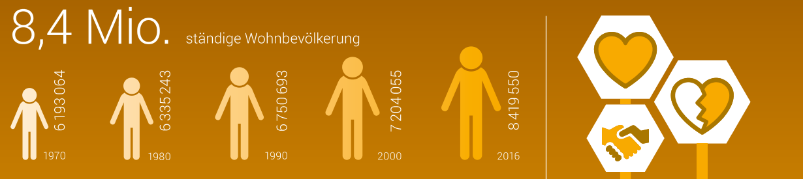

# Abbildungen

Wir können in `bookdown` entweder bestehende Grafiken einbinden (`.jpg`, `.png`) oder mit `R`-Code aus den aktuellen Daten die entsprechenden Grafiken direkt erstellen.

Abbildungen und Tabellen werden mit Legenden in den Bericht eingebunden; die Nummerierung wird intern automatisch erstellt und nachgeführt. 


Die  Abbildung \@ref(fig:grafik-extern) zeigt den Ausschnitt einer externen statischen Grafik.


(ref:grafik-extern) Die externe Grafik des BfS zeigt verschiedene Zahlen zur Bevölkerung in der Schweiz (Ausschnitt).

```{r grafik-extern, fig.cap="(ref:grafik-extern)"}
    
```


Aus den Rohdaten des BfS^[https://www.bfs.admin.ch/bfs/de/home/statistiken/bevoelkerung.html] können wir mit `R`  eine eigene Grafik mit den Daten zur Entwicklung der Bevölkerung in der Schweiz ab 1991 und den drei Haupt-Szenarien  bis 2045 erstellen.

(ref:plot-chart)  Bevölkerungsentwicklung in der Schweiz ab 1991 und die drei Szenarien 2015--2045.

```{r plot-chart, fig.cap="(ref:plot-chart)", fig.height=3.75}
    if (knitr::is_html_output()) {
        plot_chart(res, interactive = TRUE, hoehe = 2.8)
    } else {
        plot_chart(res, interactive = FALSE)
    }
```

Die Abbildung \@ref(fig:plot-chart) ist in der `HTML`-Version des Berichtes interaktiv, wenn wir mit der Maus über die Linien fahren, werden die zugehörigen Werte der Linien angezeigt. In der `PDF`-Version des Berichtes ist die gleiche Abbildung ohne Interaktivität erstellt.

Wenn sich die Rohdaten ändern, wird diese Abbildung automatisch angepasst, da sie immer aus den aktuellen Daten erstellt wird. Wir können das an Änderungen an der Datei der Szenarien zeigen (`data/su-d-01.02.04.04.xlsx`).
